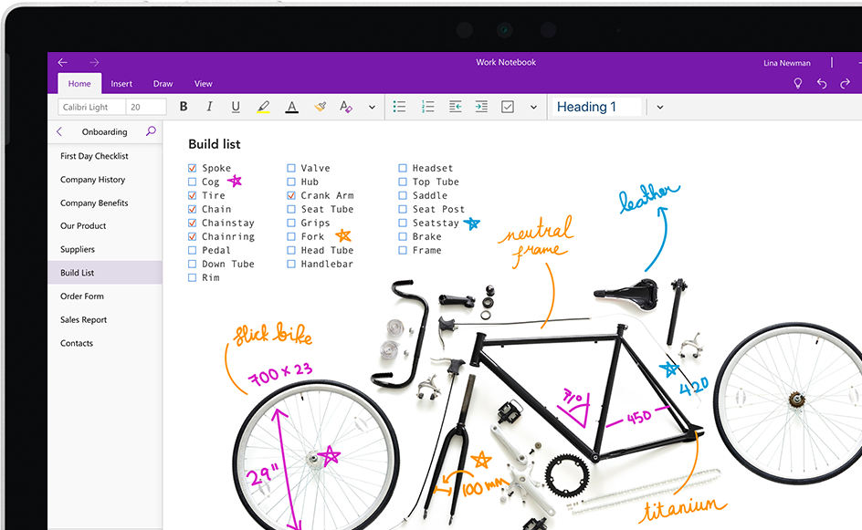

OneNote by Microsoft is a free, feature-rich electronic notebook. There is an integration for Learning Management Systems such as Canvas by Instructure to have a Class Notebook. OneNote allows for unlimited "sections" or topics, and pages for each of those sections and has apps available for iOS, Android, Windows, Mac, and a web browser. Creating a new Notebook within OneDrive allows users to access notes from anywhere. Users may also "clip" entire webpages into a notebook, section, or page through a web browser extension for Edge, Chrome, and Firefox. If the extension is not available for other browsers, a bookmarklet can clip web pages. The app allows the audio recording while taking notes and syncs the text to the recording's specific point. Users can insert images of text within a OneNote page, and the app will use Optical Character Recognition (OCR), so the recognized content is available to be searched. Dictation is available to type by speaking, and it can read aloud text on pages. Other features include: sharing pages and adding collaborators, importing PDFs and other files as attachments, "ink" to text or math, and free to use through the web and mobile apps. Many schools and organizations already have paid Office 365 or Microsoft Office suite available to students and employees. These paid licenses allow complete access to all of the features through the desktop programs.

